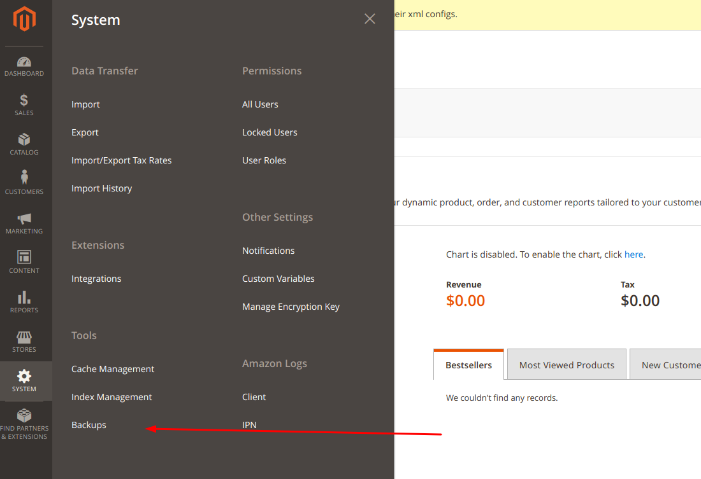
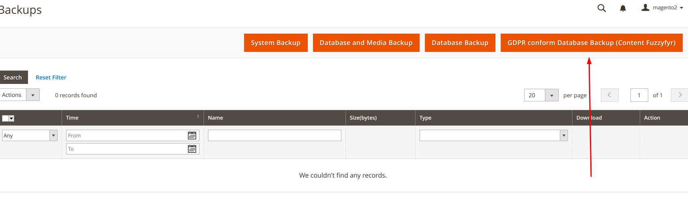
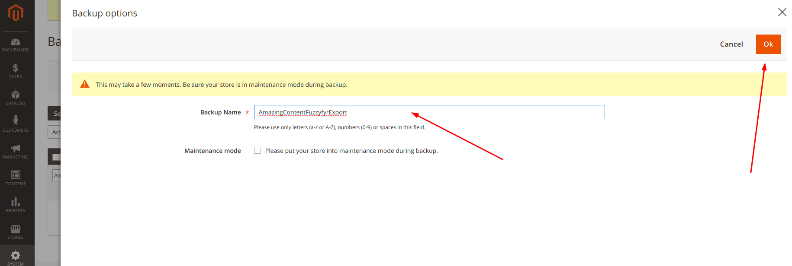
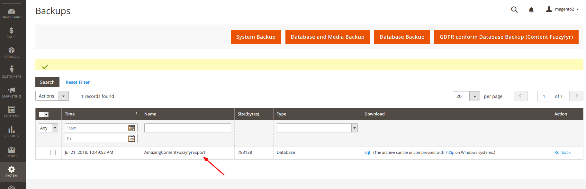

# Content Fuzzyfyr Module for Magento® 2

[](https://github.com/hivecommerce/magento2-content-fuzzyfyr/actions/workflows/ci.yml)
[](https://coveralls.io/github/hivecommerce/magento2-content-fuzzyfyr?branch=main)

The **Content Fuzzyfyr** module for *Magento® 2* fills up empty content fields - and if needed - switches real content with dummy content.
This is for development purposes, e.g. save time to prepare test data and being compliant to GDPR.

## Features:
* Fill up empty content and image fields with dummy content - completely automated
* Match GDPR compliance for development, when using production data
* Export your production database already matching GDPR compliance
* Use parameters to control the sections required to be filled up with dummy content

## Installation
The preferred way of installing `hivecommerce/magento2-content-fuzzyfyr` is through Composer.
Simply add `hivecommerce/magento2-content-fuzzyfyr` as a dependency:

```
composer.phar require hivecommerce/magento2-content-fuzzyfyr
```

Optional you can download the latest version [here](https://github.com/hivecommerce/magento2-content-fuzzyfyr/releases)
and install the decompressed code in your projects directory under *app/code/HiveCommerce/ContentFuzzyfyr*.  

## Post-Install

After the installment of the module source code, the module has to be enabled by the *Magento® 2* CLI.

```
bin/magento module:enable HiveCommerce_ContentFuzzyfyr
```

## System Upgrade

After enabling the module, the *Magento® 2* system must be upgraded.

If the system mode is set to *production*, run the *compile* command first.
This is not necessary for the *developer* mode.
```
bin/magento setup:di:compile
```

To upgrade the system, the *upgrade* command must be run.
```
bin/magento setup:upgrade
```

# User Guide
Find the complete user guide [here](./docs/UserGuide.pdf "User Guide").

## How to use

### CLI
#### Content Fuzzyfyr

The **Content Fuzzyfyr** Module for *Magento® 2* provides an *Magento® 2* CLI command *dev:content:fuzzyfyr* to modify
existing content (or only empty fields with the *--only-empty* flag) to be switched with some defined default value:

    bin/magento dev:content:fuzzyfyr [options]

**Note:** Be aware the command only runs in non-production mode to avoid messing up production data on mistake.

You may want to switch to *default* or *developer* mode to run the command:

    bin/magento deploy:mode:set developer

#### List of flags

Option | Description
--- | ---
--only-empty | Use dummy content only if the original data is equal to empty
--force | Allow execution in production mode (not recommended!)
--categories | Apply dummy content to categories (content, meta description)
--cms-blocks | Apply dummy content to CMS Blocks (content)
--cms-pages | Apply dummy content to CMS Pages (content, meta description)
--customers | Apply dummy content to customers (Last name, address, email, password)
--products | Apply dummy content to products (description)
--users | Apply dummy content to users (Last name, email)

#### List of options

Option | Value | Description
--- | --- | ---
--dummy-content-text | String | Used as dummy text content. Defaults to 'Lorem ipsum.'
--dummy-content-password | String | Used as dummy text content. Defaults to 'lorem42'
--dummy-content-email | String | Used as dummy email content. Defaults to 'lorem.ipsum.%1$s@test.localhost'
--dummy-content-url | String | Used as dummy url content. Defaults to 'https://lor.emips.um/foo/bar/'
--dummy-content-phone | String | Used as dummy phone content. Defaults to '+49 (0) 600 987 654 32'
--dummy-content-image-path | String | Used as dummy image content. Defaults to './assets/dummy_image.png'

#### How to apply custom code

An event is triggered, called *hc_content_fuzzyfyr_event*. Listening to this event, expect the following parameters
in the *Observer* data:

    'configuration' => \HiveCommerce\ContentFuzzyfyr\Model\Configuration


#### Content Export

The **Content Fuzzyfyr** Module for *Magento® 2* provides an *Magento® 2* CLI command *dev:content:export* to export an
database dump with already fuzzyfied content for existing content (or only empty fields with the *--only-empty* flag)  
switched with some defined default value:

    bin/magento dev:content:export [options]

**Note:** Running the code activates maintenance mode. The maintenance mode will be disabled, if the command has run
successfully or erroneous and the maintenance mode has been disabled in the beginning. But it is recommended to check
manually on production system after running the command.

#### List of flags

Option | Description
--- | ---
--only-empty | Use dummy content only if the original data is equal to empty
--categories | Apply dummy content to categories (content, meta description)
--cms-blocks | Apply dummy content to CMS Blocks (content)
--cms-pages | Apply dummy content to CMS Pages (content, meta description)
--customers | Apply dummy content to customers (Last name, address, email, password)
--products | Apply dummy content to products (description)
--users | Apply dummy content to users (Last name, email)

#### List of options

Option | Value | Description
--- | --- | ---
--dummy-content-text | String | Used as dummy text content. Defaults to 'Lorem ipsum.'
--dummy-content-password | String | Used as dummy text content. Defaults to 'lorem42'
--dummy-content-email | String | Used as dummy email content. Defaults to 'lorem.ipsum.%1$s@test.localhost'
--dummy-content-url | String | Used as dummy url content. Defaults to 'https://lor.emips.um/foo/bar/'
--dummy-content-phone | String | Used as dummy phone content. Defaults to '+49 (0) 600 987 654 32'
--backup-output | String | Path where the database dump is placed. Defaults to './var/backups/'

#### How to apply custom code

An event is triggered, called *hc_content_export_event*. Listening to this event, expect the following parameters
in the *Observer* data:

    'configuration' => \HiveCommerce\ContentFuzzyfyr\Model\Configuration


### Administration
#### Content Export

The **Content Fuzzyfyr** Module for *Magento® 2* extends the *Magento® 2* administration backup area with an additional
option to trigger the export of a GDPR compliant database dump. The database dump will have fuzzyfied customers and user 
data.

Navigate through the main navigation and selecting *System > Backup*:



The backup area is extended by the new button *GDPR conform Database Backup (Content Fuzzyfyr)*:



By clicking on this button, a wizard is opened to configure the backup - mainly the name of the backup file:



If the wizard is confirmed, the GDPR compliant backup will be created and visibile in the existing backup list:



## Contribution
Feel free to contribute to this module by reporting issues or create some pull requests for improvements.

## License
The **Content Fuzzyfyr** Module for *Magento® 2* is released under the Apache 2.0 license.
